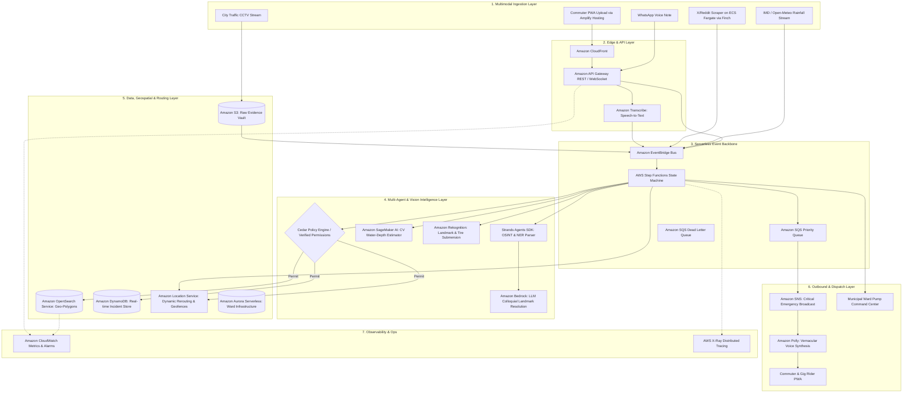

# JalMarg (जलमार्ग) — Autonomous Urban Flood-Depth Intelligence & Monsoon Navigation Protocol

> **Hackathon Track:** Heat and Water (Monsoon Waterlogging, Flash Floods, Civic Infrastructure Resilience)  
> **Theme:** Build for Bharat (AWS x WeMakeDevs Hackathon)  
> **Target Audience:** Urban Commuters, 2-Wheeler Gig Workers (Swiggy, Zomato, Porter), Emergency Services, Municipal Corporations (BBMP, BMC, MCD, GCC).

---

## 1. Executive Summary

During the Indian monsoons, cities like Bengaluru, Mumbai, Delhi-NCR, and Chennai are routinely brought to a standstill by flash waterlogging. Commuters rely on navigation apps like Google Maps that only show general traffic slowdowns (*"Dark Red"*), leaving drivers blind to whether a road is simply slow or submerged under 3 feet of water. This leads to stalled vehicles, engine seizures (*hydro-locking* costing ₹50,000–₹2,00,000 in repairs), stranded gig workers, and trapped ambulances.

**JalMarg** is an autonomous, event-driven flood intelligence and safe-navigation platform. It converts unstructured citizen photos, social media discussions, rainfall telemetry, and traffic cameras into **centimeter-accurate water-depth maps**, calculating vehicle-tailored dry routes and triggering automated municipal de-watering pump dispatches.

---

## 2. Complete Feature Matrix

### Feature 1: Social Media "OSINT" Flood Radar
* **Problem:** Citizens report flooded streets on X (Twitter), Reddit (`r/bangalore`, `r/mumbai`), and local Telegram groups 45–60 minutes before any official civic portal updates.
* **Mechanism:**
  * Autonomous agent monitors social feeds for keywords (*"waterlogged"*, *"paani bhar gaya"*, *"underpass submerged"*, *"Minto bridge"*, *"Silk board"*).
  * **Named Entity Recognition (NER):** Extracts hyper-local colloquial landmarks (e.g., *"Sony World Signal 80ft road"*, *"Bellandur eco-space flyover underpass"*).
  * **Fake & Outdated Media Filter:** Uses computer vision and metadata verification to detect viral reposts from previous years, discarding unverified media.
  * Verified incidents are geo-tagged and plotted as temporary hazard zones with direct links to the source post.

### Feature 2: Computer Vision Water-Depth Estimation Engine
* **Problem:** Binary warnings like *"Flooding ahead"* provide zero actionable context. 10 cm of water is fine for an SUV; 35 cm stalls an electric scooter.
* **Mechanism:**
  * Accepts photos from user submissions, social posts, or traffic camera feeds.
  * Analyzes relative submergence markers:
    * **Tire Rim Submersion:** $\approx 15\text{ cm}$ (Passable for all vehicles).
    * **Motorcycle Exhaust / Pedals Submerged:** $\approx 30\text{–}35\text{ cm}$ (Severe hazard for 2-wheelers).
    * **Car Grille / Median Divider Submerged:** $\approx 50\text{–}70\text{ cm}$ (Critical danger, complete roadblock).
  * Returns an exact depth metric ($\pm 5\text{ cm}$) and assigns a severity classification.

### Feature 3: Vehicle-Profile-Tailored Safe Rerouting
* **Mechanism:**
  * Users select their vehicle type: **2-Wheeler (Motorcycle/Scooter)**, **Low-Clearance Car (Hatchback/Sedan)**, or **High-Clearance (SUV/Commercial Bus)**.
  * The navigation engine calculates routes dynamically:
    * If water is $25\text{ cm}$: Green for SUVs, **Hard Red for Scooters** (diverting via an elevated flyover).
    * Prevents unnecessary 5-km detours for large vehicles while protecting vulnerable smaller vehicles from engine damage.

### Feature 4: "Time-to-Submerge" Predictive Engine *(Before It Floods)*
* **Mechanism:**
  * Correlates real-time rainfall intensity (IMD Doppler radar / Open-Meteo precipitation rate) with urban elevation topography (DEM contours).
  * If a catchment area experiences $>35\text{ mm/hr}$ rainfall for 15 minutes, the system computes the runoff accumulation rate into low-lying underpasses.
  * Issues proactive alerts: *"Indiranagar underpass is dry now, but will submerge past 30 cm in approximately 14 minutes. Diverting route now."*

### Feature 5: Hands-Free Audio Radar for Two-Wheelers & Gig Workers
* **Problem:** Delivery riders and motorcyclists cannot look at phone screens in heavy rain.
* **Mechanism:**
  * Background geolocation tracker calculates distance to the nearest active waterlogged polygon.
  * When approaching within 250 meters of a hazardous zone, it triggers natural, vernacular audio warnings through helmet earphones via Amazon Polly:
    * *Hindi:* *"सावधान: 200 मीटर आगे घुटने तक पानी भरा है। कृपया फ्लाईओवर वाला रास्ता लें।"*
    * *Kannada:* *"ಎಚ್ಚರಿಕೆ: ಮುಂದೆ 200 ಮೀಟರ್‌ಗಳಲ್ಲಿ ನೀರು ನಿಂತಿದೆ. ದಯವಿಟ್ಟು ಫ್ಲೈಓವರ್ ಮಾರ್ಗ ಬಳಸಿ."*

### Feature 6: WhatsApp Vernacular Voice-Note Reporter
* **Mechanism:**
  * Stranded commuters can send a 5-second voice note to a WhatsApp bot: *"Bhaiya, Marathahalli bridge ke neeche car ke bonnet tak paani aa gaya hai."*
  * Speech-to-text transcribes the audio, extracts the location ("Marathahalli bridge") and relative depth ("car bonnet" $\rightarrow \sim 75\text{ cm}$), and updates the incident map in under 5 seconds.

### Feature 7: Post-Flood "Hidden Pothole & Road Hazard" Memory Layer
* **Problem:** After water recedes, roads develop deep, invisible potholes and loose gravel.
* **Mechanism:**
  * Any road segment submerged for $>3\text{ hours}$ is automatically flagged with an amber **"High Pothole Risk"** warning for the subsequent 48 hours.
  * Alerts two-wheeler riders to maintain low speeds even after the road appears dry.

### Feature 8: Automated Civic Dispatch & De-Watering Pump Ticketing
* **Mechanism:**
  * If a high-density arterial road exceeds $40\text{ cm}$ depth for $>20\text{ minutes}$, an automated priority ticket is generated for the respective municipal ward (e.g., BBMP Ward #150).
  * Dispatches exact GPS coordinates, depth estimation, and photo evidence to municipal suction pump operators.

---

## 3. Comprehensive AWS Services Matrix

To maximize evaluation scores on the AWS hackathon criteria, every single tier of the platform uses the AWS open source and cloud ecosystem:

```
┌─────────────────────────────────────────────────────────────────────────────────────────────────┐
│                                 JALMARG COMPLETE AWS STACK                                      │
├───────────────────────────────┬─────────────────────────────────────────────────────────────────┤
│ LAYER                         │ AWS SERVICES USED                                               │
├───────────────────────────────┼─────────────────────────────────────────────────────────────────┤
│ 1. Agents & AI                │ • Strands Agents SDK (Local Multi-Agent Orchestration)          │
│                               │ • Amazon SageMaker AI (CV Depth Estimation & Inference)         │
│                               │ • Amazon Bedrock (Multilingual Indian NER & Intent Parsing)     │
│                               │ • Amazon Rekognition (Tire/Vehicle Object Landmark Benchmark)   │
│                               │ • PartyRock (Rapid UI/Agent Workflow Prototyping)               │
├───────────────────────────────┼─────────────────────────────────────────────────────────────────┤
│ 2. Voice & Multimodal Media   │ • Amazon Polly (Neural Vernacular Text-to-Speech Radar)         │
│                               │ • Amazon Transcribe (Multilingual WhatsApp Audio Ingestion)     │
├───────────────────────────────┼─────────────────────────────────────────────────────────────────┤
│ 3. Maps & Location Services   │ • Amazon Location Service (Geofencing, Route Calculation,       │
│                               │   Reverse Geocoding, Vector Tile Styles)                        │
├───────────────────────────────┼─────────────────────────────────────────────────────────────────┤
│ 4. Serverless & Orchestration │ • AWS Step Functions (State Machine Incident Verification)      │
│                               │ • AWS Lambda (Microservice Event Handlers)                      │
│                               │ • Amazon API Gateway (REST & WebSocket Live Map Sync)          │
│                               │ • AWS SAM CLI (Local Build, Package & Deploy)                   │
│                               │ • LocalStack (Offline Local Cloud Emulation)                    │
├───────────────────────────────┼─────────────────────────────────────────────────────────────────┤
│ 5. Containers & Runtimes      │ • Finch (Open-source Container CLI for Local Image Packaging)   │
│                               │ • AWS App Runner / Amazon ECS on Fargate (Scrapers & Workers)   │
│                               │ • Amazon Corretto (Production OpenJDK Runtime)                  │
│                               │ • Firecracker (Sandboxed MicroVM Isolation for Untrusted Media) │
├───────────────────────────────┼─────────────────────────────────────────────────────────────────┤
│ 6. Data, Search & Storage     │ • Amazon OpenSearch Service (Geospatial Polygon Indexing)       │
│                               │ • Amazon DynamoDB (Single-digit ms Incident Store & TTL Expiry) │
│                               │ • Amazon S3 (Raw Evidence Photos, Audio Notes, Video Feeds)     │
│                               │ • Amazon Aurora Serverless / RDS (Ward Boundaries & Pump Assets)│
├───────────────────────────────┼─────────────────────────────────────────────────────────────────┤
│ 7. Auth, Security & Policy    │ • Cedar Policy Engine (Open-Source Authorization Definition)    │
│                               │ • Amazon Cognito (Citizen & Municipal Role-Based Pools)         │
│                               │ • AWS Verified Permissions (Managed Cedar Policy Evaluation)    │
├───────────────────────────────┼─────────────────────────────────────────────────────────────────┤
│ 8. Plumbing & Event Streaming │ • Amazon EventBridge (Event Mesh for Ingestion & Scrapers)      │
│                               │ • Amazon EventBridge Pipes (Stream-to-Queue Integrations)       │
│                               │ • Amazon SQS (Dead-Letter & Prioritized Dispatch Queues)        │
│                               │ • Amazon SNS (Vernacular Push, SMS & Broadcast Alerts)          │
│                               │ • Amazon CloudFront (Global Low-Latency CDN Edge Caching)       │
│                               │ • Amazon Route 53 (DNS & Health-Check Failover Routing)         │
├───────────────────────────────┼─────────────────────────────────────────────────────────────────┤
│ 9. Observability & Operations │ • Amazon CloudWatch (Logs, Alarms & Operational Dashboards)     │
│                               │ • AWS X-Ray (End-to-End Distributed Request Tracing)            │
├───────────────────────────────┼─────────────────────────────────────────────────────────────────┤
│ 10. Frontend & Client Hosting │ • AWS Amplify Hosting (Continuous Deployment & PWA Hosting)     │
└───────────────────────────────┴─────────────────────────────────────────────────────────────────┘
```

---

## 4. End-to-End System Architecture



---

## 5. Deep-Dive: How Each AWS Service is Used

### 1. Agents, Generative AI & Vision
* **Strands Agents SDK (Local / Open Source):**
  * Coordinates multi-agent reasoning. Contains specialized sub-agents:
    1. *Scraper Agent:* Extracts social media threads.
    2. *Validation Agent:* Cross-references multi-source reports.
    3. *Dispatch Agent:* Calculates civic notification payloads.
* **Amazon SageMaker AI:**
  * Hosts the PyTorch-based Depth Estimation model. Calculates distance between detected vehicle axles, wheel rims, and the detected water reflection line.
* **Amazon Bedrock:**
  * Uses lightweight foundation models (e.g., Claude 3 Haiku / Amazon Titan) to parse unstructured Indian text containing Hinglish, Kannada-English, and colloquial city slangs into normalized coordinates.
* **Amazon Rekognition:**
  * Serves as a fast pre-filter to detect whether an uploaded photo actually contains vehicles, roads, and water before running expensive depth models.
* **PartyRock:**
  * Used during sprint hour 1 to rapidly prototype and share prompt chains for colloquial Indian landmark extraction with team members.

### 2. Voice & Vernacular Accessibility
* **Amazon Polly:**
  * Generates low-latency Neural Text-to-Speech audio in **Hindi (Aditi)**, **Indian English (Kajal/Raveena)**, and regional dialects for the 2-wheeler hands-free radar.
* **Amazon Transcribe:**
  * Processes inbound WhatsApp audio notes, transcribing multi-lingual audio into text in real-time.

### 3. Location, Maps & Rerouting
* **Amazon Location Service:**
  * **Geofencing:** Evaluates when a moving user enters within 300 meters of a waterlogged polygon.
  * **Routing Matrix:** Computes detour travel times and provides turn-by-turn navigation that avoids flooded bounding boxes based on the vehicle clearance profile.
  * **Vector Map Tiles:** Serves crisp, customized map styles directly to the PWA frontend.

### 4. Serverless Orchestration & Local Emulation
* **AWS Step Functions:**
  * Manages the complete distributed workflow:
    `Ingest` $\rightarrow$ `Transcribe/Parse` $\rightarrow$ `Evaluate Cedar Policy` $\rightarrow$ `Run SageMaker Depth Model` $\rightarrow$ `Index in OpenSearch` $\rightarrow$ `Check Depth Threshold` $\rightarrow$ `Trigger Polly / SNS Alert` $\rightarrow$ `Log to CloudWatch`.
* **AWS SAM CLI & LocalStack:**
  * Entire serverless infrastructure is coded in `template.yaml`.
  * Fully executable locally on development laptops using LocalStack to simulate Lambda, S3, DynamoDB, SQS, and EventBridge without spending cloud credits during rapid testing.

### 5. Containers & Sandboxing
* **Finch:**
  * Open-source container client used locally on macOS to build, package, and test Docker images for the social media scrapers without Docker Desktop licensing constraints.
* **AWS App Runner / Amazon ECS on AWS Fargate:**
  * Runs long-running background OSINT listeners and high-throughput image preprocessing containers with zero server management.
* **Amazon Corretto:**
  * High-performance, production-ready distribution of OpenJDK used for backend microservices and local search tooling.
* **Firecracker:**
  * Underlying serverless microVM execution layer ensuring untrusted citizen-uploaded files and media are processed in isolated, transient environments.

### 6. Data, Search & Storage
* **Amazon OpenSearch Service:**
  * Stores road geometry with `geo_shape` mapping. Enables sub-10ms queries for finding all submerged roads intersecting a commuter's planned route.
* **Amazon DynamoDB:**
  * Handles high-frequency write throughput from crowdsourced reports.
  * Uses **DynamoDB Time-To-Live (TTL)** to automatically expire transient flood warnings after 4 hours, transitioning them into the "Pothole Risk" state.
* **Amazon S3:**
  * Stores raw citizen photos, CCTV frame captures, and generated audio alert files with S3 Lifecycle policies.
* **Amazon Aurora Serverless:**
  * Stores municipal asset tables: drainage pump capacities, ward contact registries, and municipal boundary polygons.

### 7. Governance & Security with Cedar
* **Cedar Policy Engine & AWS Verified Permissions:**
  * Evaluates fine-grained authorization policies at sub-millisecond speeds. Prevents rogue users from creating fake traffic panic.

```cedar
// 1. Regular citizens can submit reports, but cannot toggle official road closures
permit (
    principal in Role::"Citizen",
    action in [Action::"SubmitReport", Action::"UploadMedia"],
    resource in IncidentReport
);

// 2. Only Verified Traffic Police or Municipal Engineers can mark roads OFFICIALLY BARRICADED
permit (
    principal in Role::"CivicAuthority",
    action in [Action::"ConfirmBarricade", Action::"DispatchPumpUnit"],
    resource in RoadSegment
)
when {
    context.hasValidCivicBadge == true &&
    context.assignedWardId == resource.wardId
};

// 3. Automated Vision Agents can update depth metrics only when confidence >= 85%
permit (
    principal in Agent::"SageMakerDepthEstimator",
    action in [Action::"PublishDepthMetric"],
    resource in RoadSegment
)
when {
    context.modelConfidence >= 0.85
};
```

### 8. Plumbing, Networking & Observability
* **Amazon EventBridge & EventBridge Pipes:**
  * Asynchronous event bus connecting ingestion sources, DynamoDB Streams, and Step Functions workflows.
* **Amazon SQS & Amazon SNS:**
  * SQS queues absorb sudden traffic spikes during citywide cloudbursts.
  * SNS delivers push notifications and emergency SMS alerts to subscribers within affected wards.
* **Amazon CloudFront & Amazon Route 53:**
  * CloudFront caches map tiles and frontend assets at edge locations across India (Mumbai, Delhi, Chennai, Hyderabad, Bengaluru, Kolkata) for lightning-fast mobile loading.
* **Amazon CloudWatch & AWS X-Ray:**
  * CloudWatch provides real-time latency alarms and incident ingestion graphs.
  * AWS X-Ray traces end-to-end request journeys from the citizen's photo upload down to OpenSearch indexing.

### 9. Frontend & Deployment
* **AWS Amplify Hosting:**
  * Automated CI/CD pipeline connected to GitHub, deploying the mobile-first Progressive Web App with zero manual server config.

---

## 6. Frontend Design System & UI/UX Standards

Adhering to anti-slop frontend principles (`design-taste-frontend`):

* **Aesthetic Direction:** **"Midnight Tactical Storm"**
  * Deep midnight slate background (`#080C14`), dark glassmorphic cards with `backdrop-filter: blur(12px)`.
  * High-contrast, semantic status colors:
    * **Clear & Dry:** `#10B981` (Emerald Green)
    * **Caution / Moderate (10–25 cm):** `#F59E0B` (Amber Neon)
    * **Submerged / Critical (>35 cm):** `#EF4444` (Crimson Pulse)
    * **Post-Flood Pothole Risk:** `#8B5CF6` (Tactical Purple)
* **Typography:** `Outfit` / `Inter` from Google Fonts; clean, tabular numeric readouts for water depth (`42 cm`).
* **Mobile Interaction:**
  * Draggable bottom sheet on mobile devices.
  * Single-tap vehicle switcher in the top navigation bar (**🛵 2-Wheeler** | **🚗 Car** | **🚙 SUV**).
  * Audio Radar floating badge that pulses green when active and displays soundwaves during audio warnings.
  * Zero generic landing page templates; focused entirely on real-time situational awareness.

---

## 7. Step-by-Step Hackathon Implementation Plan

```mermaid
gantt
    title JalMarg 36-Hour Hackathon Implementation Timeline
    dateFormat  HH:mm
    axisFormat  %H:%M

    section Phase 1: Local Foundation
    SAM CLI Init & LocalStack Configuration :00:00, 04:00
    Finch Container Setup & Corretto Runtime  :02:00, 05:00
    OpenSearch Docker & DynamoDB Local Setup :03:00, 06:00

    section Phase 2: AI & Agent Core
    Strands Agent (Social Scraper & NER)     :05:00, 11:00
    SageMaker Depth Vision Pipeline / Mock    :07:00, 13:00
    Cedar Policy Rules in Verified Permissions:10:00, 14:00

    section Phase 3: Spatial & Plumbing
    Step Functions State Machine Assembly    :12:00, 18:00
    OpenSearch Geo-Polygon Indexing & Queries:14:00, 20:00
    Amazon Location Service Routing Matrix   :17:00, 22:00
    Amazon Polly Vernacular Audio Engine     :20:00, 24:00

    section Phase 4: Frontend & Delivery
    Amplify Hosting & PWA Setup              :22:00, 26:00
    Interactive Map with Dynamic Detour Lines:24:00, 31:00
    WhatsApp Voice Simulation & Civic Dash   :28:00, 33:00

    section Phase 5: Polish & Pitch
    CloudWatch Dashboard & X-Ray Tracing Demo:32:00, 34:00
    Rehearsal of 3-Minute Winning Pitch      :34:00, 36:00
```

### Detailed Phase Breakdown:

#### Phase 1: Local Setup & Serverless Scaffolding (Hours 0–4)
1. Initialize local repository with AWS SAM CLI (`sam init`).
2. Boot up **LocalStack** via Docker to emulate DynamoDB, S3, SQS, and EventBridge locally.
3. Configure `template.yaml` defining serverless infrastructure as code.
4. Set up **Finch** on macOS for building scraper container images.

#### Phase 2: Agentic Intelligence & Vision (Hours 4–12)
1. Write the **Strands Agents SDK** script to parse simulated tweets and Reddit posts, extracting locations and media attachments.
2. Integrate **Amazon Bedrock** prompt to resolve colloquial landmark names to lat/long coordinates.
3. Build the Computer Vision depth estimation module (or SageMaker endpoint) that analyzes tire submersion ratios.
4. Author and compile **Cedar** policies using the Cedar CLI.

#### Phase 3: Spatial Data & Event Plumbing (Hours 12–20)
1. Spin up **OpenSearch** with a `geo_shape` index for road segments and flood polygons.
2. Construct the **AWS Step Functions** state machine connecting Lambda handlers, Cedar policy checks, and OpenSearch indexing.
3. Wire up **Amazon Location Service** for vehicle-specific route calculations around flooded bounding boxes.
4. Connect **Amazon Polly** to generate instant MP3 vernacular warning snippets.

#### Phase 4: Frontend Development & Deployment (Hours 20–30)
1. Create a modern PWA using Vite + React + Vanilla CSS + MapLibre GL.
2. Deploy to **AWS Amplify Hosting**.
3. Implement interactive controls:
   * Real-time flood map with pulsing depth markers.
   * Vehicle profile selector triggering immediate route recalculation.
   * Hands-free audio player streaming Amazon Polly voice warnings.
   * Simulated WhatsApp voice note recorder.
4. Build the "Municipal Ward Officer" dashboard showing live pump dispatch tickets.

#### Phase 5: Observability, Dry-Run & Pitch Rehearsal (Hours 30–36)
1. Configure an **Amazon CloudWatch** dashboard displaying real-time metrics: *Active Flooded Segments*, *Average Depth (cm)*, *Pump Dispatch Latency*.
2. Capture **AWS X-Ray** service maps showing the complete distributed call graph for the judges.
3. Practice the 3-minute pitch script with the live application.

---

## 8. The 3-Minute Judge Winning Demo Script

* **0:00 – 0:40 (The Problem & Empathy):**  
  *"Judges, how many of you have driven into a flooded underpass in Bangalore or Mumbai because Google Maps only showed 'Heavy Traffic'? You enter, your engine sucks in water, stalls, and you're left with a ₹1 Lakh repair bill. Google Maps knows vehicle speed; it has no clue about water depth."*
* **0:40 – 1:20 (Live Demo: Ingestion & Vision):**  
  *Open the PWA:* *"Here is JalMarg. Watch our OSINT agent detect an urgent tweet from Silk Board. Or watch what happens when a commuter uploads a photo of an underpass: our SageMaker depth model detects the submerged car wheels and calculates water depth at 46 cm within 1.2 seconds."*
* **1:20 – 2:00 (Vehicle-Specific Routing & Hands-Free Audio):**  
  *Toggle vehicle selector:* *"Watch the route line. For a Thar or Bus, the road is passable. But switch to 2-Wheeler: it immediately diverts over the flyover. And for delivery gig workers who can't look at screens in torrential rain, listen to this Amazon Polly voice warning in Hindi."* *(Play audio).*
* **2:00 – 2:40 (The AWS Architectural Muscle):**  
  *Show architecture diagram & CloudWatch dashboard:* *"This isn't a surface-level demo. We use AWS Step Functions to orchestrate our Strands Agents, Amazon OpenSearch for sub-millisecond polygon avoidance, Amazon Location Service for routing, and Cedar to ensure fraudulent reports cannot maliciously close city streets. The entire stack was developed locally using LocalStack and SAM CLI."*
* **2:40 – 3:00 (The Vision for Bharat):**  
  *"JalMarg protects delivery workers, saves personal vehicles, and equips municipal corporations with automated pump dispatch data. This is real, scalable climate resilience for urban Bharat."*
